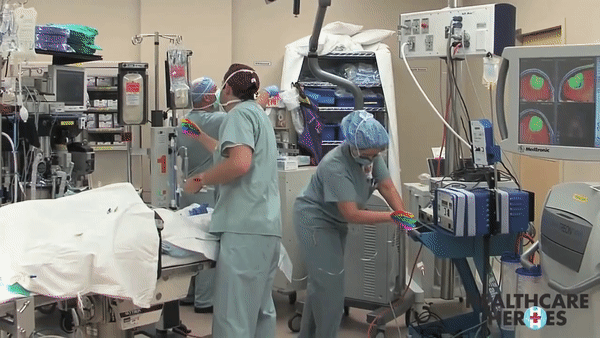
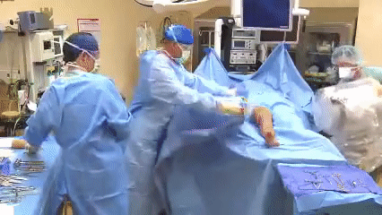

# surgery-tracker

Code for hand-tracking in surgery video datasets.

Things to do:

- Select subset of surgery videos from the following [YouTube playlist](https://www.youtube.com/playlist?list=PLegrqXHtHobDKdZDCcao5N9fweWrNIOej)
  - Do so based on quality, viewpoints, (and time? Maybe keep videos trimmed in a first pass)
- Run out-of-the-box pre-trained hand trackers on videos. Pretrained trackers include:
  - [OpenPose](https://github.com/CMU-Perceptual-Computing-Lab/openpose)
  - [DensePose](https://github.com/facebookresearch/DensePose)
  - [GANerated hands](https://handtracker.mpi-inf.mpg.de/projects/GANeratedHands/)
- Think about how well they do and visualize.

### Surgeries

Just a heads-up these links are kinda graphic.

| Surgery                                                      | Timestamp     | Quality | Viewpoint                          | Description                                                                                                                                         |
| ------------------------------------------------------------ | ------------- | ------- | ---------------------------------- | --------------------------------------------------------------------------------------------------------------------------------------------------- |
| [link](https://www.youtube.com/watch?v=QRW1qV2lWcE&t=1m30s)  | 1:00 - 1:30   | High    | Top-down, Zoomed In                | Top-down, high quality video with multiple hands and various tools. Some blocking and cropping out of hands due to zoom. Also periodic transitions. |
| [link](https://www.youtube.com/watch?v=GT-FLlE95KU&t=2m51s)  | 2:51 - 4:00   | Medium  | Sideways, Zoomed In                | Multiple hands with some cropping out and obstruction.                                                                                              |
| [link](https://www.youtube.com/watch?v=GT-FLlE95KU&t=16m30s) | 16:30 - 17:15 | High    | Top-down, Zoomed In                | Relatively fast and varied movement of main hand poking things, which also sometimes darts in and out of the frame.                                 |
| [link](https://www.youtube.com/watch?v=xcew3ycbG50&t=1m:37s) | 1:37 - 1:55   | Medium  | Top-down, zooms in during the clip | Dark lighting, frequent transitions, changes in hand positions and activities                                                                       |
| [link](https://www.youtube.com/watch?v=xcew3ycbG50&t=1m57s)  | 1:57 - 2:13   | Medium  | Sideways,                          | Low lighting, variable zoom, various hand movement                                                                                                  |
| [link](https://www.youtube.com/watch?v=xcew3ycbG50&t=4m09s)  | 4:09 - 4:20   | Low     | Top-down                           | Multiple hands, dark lighting, some transition and hand moving out of frame                                                                         |
| [link](https://www.youtube.com/watch?v=xcew3ycbG50&t=4m23s)  | 4:23 - 4:31   | Low     | Sideways, zoomed out               | Multiple hands, some obstruction / bad lighting / similarly colored gloves wrt background                                                           |
| [link](https://www.youtube.com/watch?v=iUwBjZUs_xo&t=1m08s)  | 1:08 - 1:35   | Medium  | Sideways, zoomed in                | Very zoomed in close up procedure, with parts of hands cropped out                                                                                  |
| [link](https://www.youtube.com/watch?v=VFyJ65hEF3k&t=1m06s)  | 1:06 - 1:14   | High    | Top-down                           | Pretty clear top-down view of two hands without much movement                                                                                       |
| [link](https://www.youtube.com/watch?v=txCYSkZIrjE&t=0m08s)  | 0:08 - 1:05   | High    | Top-down                           | Pretty clear view of opening surgery procedure (seems like ego-centric wrt surgeon)                                                                 |
| [link](https://www.youtube.com/watch?v=txCYSkZIrjE&t=10m37s) | 10:37 - 11:02 | Medium  | Top-down                           | Some frame changes with egocentric view, so hands come in and out. Multiple hands, lots of tools                                                    |
| [link](https://www.youtube.com/watch?v=AGQ-PTm4-HA&t=3m45s)  | 3:45 - 4:15   | Low     | Top-down, zoomed in                | Some obstruction, cropping out, some minor transitions, tool work                                                                                   |
| [link](https://www.youtube.com/watch?v=OtqdK-IHp5U&t=0m36s)  | 0:36 - 0:44   | Medium  | Top-down                           | Knot-tying, more intricate movements                                                                                                                |
| [link](https://www.youtube.com/watch?v=OtqdK-IHp5U&t=0m26s)  | 0:22 - 0:35   | Low     | Top-down                           | Knot-tying, worse quality                                                                                                                           |
| [link](https://www.youtube.com/watch?v=OtqdK-IHp5U&t=3m03s)  | 3:03 - 3:16   | High    | Top-down                           | Instructional video of knot-tying, intricate finger movements, clear                                                                                |

## Preliminary Findings

1. Out-of-the-box implementations are only satisfying in limited cases.

Installation is (much) easier said than done.

- Large room for improvement.

### OpenPose

Default OpenPose seems to rely heavily on the presence of a larger body in frames.

When entire humans are in the frame, performs great:  

Can also perform hand key-point detection in less zoomed out settings, as long as body can be detected:  

And seems to be robust to a degree to lower quality videos:  

However close-ups do not do so well:  

### More examples can be found [here](https://drive.google.com/open?id=1cBf7si28Vvn1e9SN4bIukgjV_YQZoEdD)

## Takeaways

Hand detection seems promising, although current implementations require additional functionality with regard to limited body presence.

- Current hand detection relies on using body pose as anchor to extrapolate starting coordinates
- Some repos deal with this specifically by combining an explicit hand-detection model to substitute this body-dependent anchoring with a hand-focued bounding box
  - Still working on doing something like this on myself (installation pains don't help)
  - Others seem to have limitations (e.g. only estimate one hand)
- But makes the problem extra worthwhile to pursue!
  - If current methods are annoying to install or lacking in ability, there's more room to make improvements.
